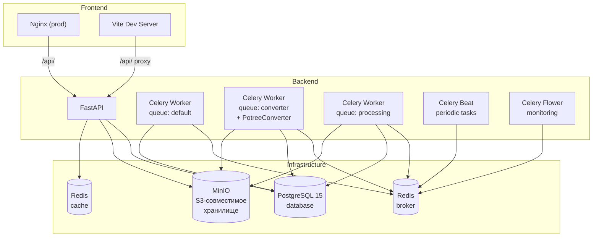

<h1 align="center">AirBIM</h1>

<div align="center">
  
    
</div>

<p align="center">Веб-приложение для совместной и одиночной работы с <b>облаками точек</b> и <b>BIM</b>, которое позволяет автоматически находить и анализировать отклонения, фиксировать прогресс и получать готовую документацию на месте</p>
<p align="center">AirBIM использует ИИ-алгоритмы для автоматической обработки, аналитики, сопоставления, что позволяет добиваться высокой точности измерений</p>

## ✨ Возможности
*	Управление рабочими пространствами, проектами и этапами, и их файлами
*	Совместная работа в одном пространстве
*	Добавление людей в свое командное пространство и управление ими
*	Автоматическая конвертация файлов для использования
*	Проведение сравнения план-факт на основе проектной модели (BIM) и реального скана (облако точек) с выявлением отклонений
*	Проведение отслеживания прогресса между разными этапами на основе их сканов
*	Отслеживание прогресса текущих процессов (задач) в реальном времени
*	Запись и документация проведенных операций с возможностью скачивания отчетов (`.pdf` и `.xlsx`)
*	Просмотр облаков точек (загруженных, отображающих прогресс работ или отклонения) с возможностью редактирвания
*	Удобная установка с помощью Docker
*	Быстрая обработка мощными алгоритмами

Поддерживается формат `.ifc` для BIM-моделей и `.laz` для данных сканирования (LiDAR-формат)


## 🚀 Начало работы

### Установка
**ВАЖНО**: перед установкой удостоверьтесь, что вам был предоставлен `.github_token` для доступа к пакету обработки данных

**ИСПОЛЬЗОВАНИЕ GPU ВЕРСИИ ПРИЛОЖЕНИЯ ТРЕБУЕТ ЗНАЧИТЕЛЬНЫХ ВЫЧИСЛИТЕЛЬНЫХ РЕСУРСОВ**

1. Клонировать репозиторий
```bash
git@github.com:ABASgroup/AirBIM.git
```

2. Создать/получить `.env` файл по образцу из `example.env`

3. Запустить приложение одной из команд
_PowerShell (Windows)_
```powershell
# запуск
.\airbim.ps1 start
# режим разработки
.\airbim.ps1 start --dev
# режим с использованием GPU
.\airbim.ps1 start --dev --gpu
```

_Bash_
```bash
# запуск
./airbim.sh start
# режим разработки
./airbim.sh start --dev
# режим с использованием GPU
./airbim.sh start --dev --gpu
```

### Использование
Вы можете получить доступ к любой части приложения, ориентируясь на ваши Docker-котейнеры

Стандартные URL при локальном развертывании (порты меняются в зависимости от `.env`):
- Фронтенд (клиент, основное приложение)
```http://localhost:5173```

- Бэкенд
```http://localhost:8000```

- Автоматически генерируемая документация API
```http://localhost:8000/docs```


### Другие команды

## 🔨 Используемые технологии
| Технология | Назначение |
|---|---|
|  | UI-библиотека |
|  | Сборщик |
|  | CSS-фреймворк |
|  | Маршрутизация |
|  | Управление формами |
|  | 3D-рендеринг |
|  | IFC-парсер |
|  | HTTP-клиент |
|  | Поповеры и тултипы |
|  | Иконки |
|  | Линтер |
|  | Язык разработки |
|  | Web-фреймворк |
|  | ASGI-сервер |
|  | Валидация данных |
|  | ORM |
|  | Миграции БД |
|  | Очередь задач |
|  | Мониторинг Celery |
|  | Аутентификация |
|  | Хеширование паролей |
|  | Генерация PDF-отчётов |
|  | Генерация Excel-отчётов |
|  | Контейнеризация |
|  | База данных |
|  | Кэш / брокер сообщений |
|  | S3-совместимое хранилище |
|  | Управление окружениями |
|  | Обработка облаков точек |
|  | Научные вычисления |


## 📦 Docker-инфраструктура



| Сервис | Образ | Назначение |
|---|---|---|
| `backend` | `python:3.12-slim` + `uvicorn` | FastAPI приложение, REST API |
| `worker` | `python:3.12-slim` + `celery` | Очередь задач `default` |
| `worker-converter` | `python:3.12-slim` + `PotreeConverter` | Очередь `converter` — конвертация LAS/LAZ в Potree |
| `worker-processing` | `micromamba` + `PDAL` | Очередь `processing` — обработка и тяжелые операции |
| `beat` | `python:3.12-slim` + `celery beat` | Периодические задачи |
| `flower` | `python:3.12-slim` + `flower` | Веб-мониторинг Celery |
| `database` | `postgres:15-alpine` | Реляционная БД |
| `cache` | `redis:latest` | Кэширование |
| `broker` | `redis:latest` | Брокер сообщений для Celery |
| `storage` | `quay.io/minio/minio` | S3-совместимое объектное хранилище |

---

## ⚙️ Архитектура

### Слои backend

```
api/routers/       ← HTTP-обработчики (FastAPI routes)
services/          ← Бизнес-логика
repositories/      ← Data Access Layer (SQLAlchemy async)
models/            ← ORM-модели (SQLAlchemy)
schemas/           ← Pydantic-схемы (request/response)
infrastructure/    ← интерфейсы для взаимодействия с подсистемами приложения (Celery, database, storage)
core/              ← конфиги, зависимости, исключения, безопасность и т.д.
tasks/             ← Celery-задачи по очередям и назначениям
migrations/        ← Alembic и миграции БД
utils/             ← функции общего пользования (convert, files, report_generation)
```

## 📝 Документация и ресурсы
Наша проектная находится в отдельном репозитории - [вот здесь](https://github.com/ABASgroup/docs)

Мы периодически актуализируем информацию

### Дополнительные ресурсы
Макет в Figma - [ссылка](https://www.figma.com/site/11jr6IOGESwsjsrA6LKKrL/AirBIM2?node-id=0-1&p=f&t=QF4RBP7pC8rFu4tm-0)

ER-диаграмма - [ссылка](https://dbdiagram.io/d/AirBIM-6990a710bd82f5fce2b8cdfc)


